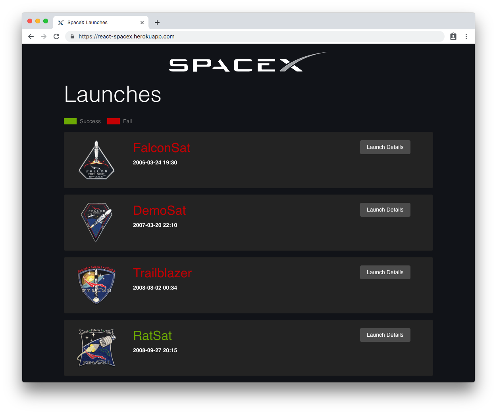
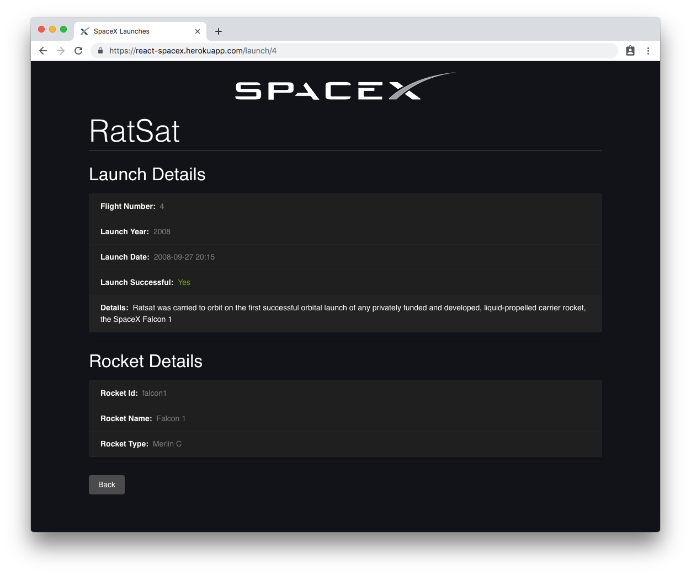

# React SpaceX

App that lists SpaceX launch missions with Express, React and GraphQL.

## Demo

- App

  https://react-spacex.herokuapp.com

- GraphiQL

  https://react-spacex.herokuapp.com/graphql

- Screenshots

  

  
  
## SpaceX API v3
- https://docs.spacexdata.com

## Tecnologies

- [Node.js](https://nodejs.org/)
- [Express](https://expressjs.com/)
- [GraphQL](https://graphql.org/)
- [ReactJS](https://reactjs.org/)
- [Apollo GraphQL](https://www.apollographql.com/)

## Author

- [@giovanigenerali](https://github.com/giovanigenerali)
